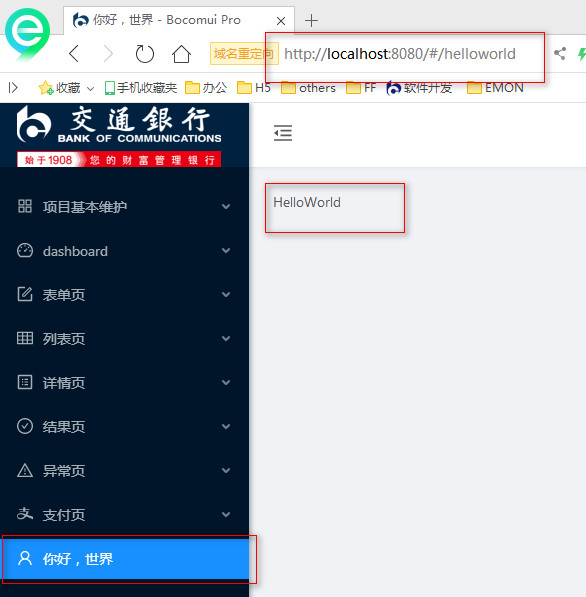
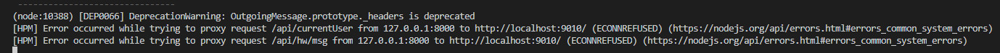

# SPA开发框架
## 1.1 SPA 简介
SPA（Single-page application）：单页应用是一种Web应用程序，它通过增量界面更新而不是从服务器加载整个新页面更新来与用户交互，这种方法避免了连续页面之间用户体验的中断，使应用程序更像桌面应用程序。在SPA站点中，可以使用单个页面加载检索所有必需的代码（HTML，JavaScript和CSS），或者根据需要动态加载相应的资源并将其添加到页面中，通常情况下是用户与站点的交互操作。
JUMP-UI SPA PC端开发框架[`jump-spa-react`](http://182.119.80.93/jumpui/jump-spa-react)是基于目前国内最流行的`ant-design-pro v1`项目进行改造的。移动端开发框架`jump-mobile-h5`是采用前端主流的开发环境构建架构：`Webpack + Babel + react + react-router + react-redux`实现的。目前移动端建议使用手机银行4.0的移动端开发框架，手机银行4.0实现了一套移动端标准样式组件库。
## 1.2 jump-spa-react-light
### 1.2.1 简介
`JUMP-SPA-React-Light`是轻量版的SPA开发框架，与`JUMP-SPA-React`开发框架最大的区别是不在强制使用`Redux-saga`进行数据管理，进而降低开发难度。
**开发建议**
- 仅页面使用数据，建议直接在页面引入相应的`services`，在页面直接进行处理，提高单一功能的高内聚。
- 非全局使用的数据，不建议放到`Redux`中托管，因此会增加延续性项目的代码阅读难度。
- 建议优先采用`async/await` 语法糖，可以提到代码的可读性。
- `react-redux` `connect`参数到`mapStateToProps`和`mapDispatchToProps`推荐采用简写方式
```js
  
  import { connect } from "react-redux";
  import {
    incrementSync,
    decrementSync,
  } from "@/redux/actions/counter";
  
  // 默认写法
  const mapStateToProps = (state, ownProps) => {
    // ownProps 组件自身得props
    console.log(ownProps);
    const { counter } = state;
    return { counter };
  };
  const mapDispatchToProps = (dispatch, ownProps) => ({
    incrementSync: () => dispatch(incrementSync()), // dispatch action creator
    decrementSync: () => dispatch(decrementSync()),
  });
  
  export default connect(mapStateToProps, mapDispatchToProps)(Counter);
  
  // 简写写法（推荐）
  export default connect(({ counter }) => ({ counter }), {
    incrementSync,
    decrementSync,
  })(Counter);
  ```
### 1.2.2 框架说明
#### 1.2.2.1 框架技术栈
`webpack5.x` 、 `babel7.x` 、`eslint7.x` 、`react17.x` 、 `react-router5.x` 、`react-redux7.x`、`redux-thunk2.x`、`antd4.x`。
#### 1.2.2.2 目录结构
```js
+---.vscode				// vscode配置，已配置自动格式化。
+---build				// 构建配置文件目录
+---mock				// mock 服务目录
|   \---data			
+---src					// 源码目录
|   +---assets			// 参与资源打包目录，注意不要参与打包静态资源，可以直接放到static中
|   |   +---img			// 图片
|   |   +---less		// 全局less样式文件
|   |   \---svg			// svg
|   +---components		// 项目组件库目录
|   +---redux			// 全局状态管理（redux）目录
|   |   +---actions		
|   |   +---reducers
|   |   \---store
|   +---routes			// 路由配置目录
|   +---services		// 后端请求服务目录
|   +---utils			// 工具目录
|   \---views			// 路由页面目录
|       +---counter
\---static				// 静态资源目录
```
#### 1.2.2.3 框架特点
- **关于上下文（Context）**和`publicPath`
前端项目部署一般有两种，采用根目录部署（https://127.0.01:8080/#/login）和采用有上下文方式部署（https://127.0.01:8080/Context/#/login），两种不同部署方式对于绝对路径资源（如：`"/hello.png"`）解析是不同的，因此框架做了统一处理，在打包后统一调整成相对路径方式（如：`"./hello.png"`）。如果项目组希望打包后直接包括上下文目录输出，可以在`/build/config.js`中配置`CONTEXT_PATH`。
- 关于图片
对于静态资源的图片（不参与项目构建的图片，如：未来需要根据节日直接在服务器上替换的图片），直接放在`static`目录中，在使用的地方需要引入`PUBLIC_PATH`变量。
```jsx
  import React from "react";
  import { PUBLIC_PATH } from "@/utils/global";
  
  export default function ImgDemo() {
    return (
      <div>
        
        
        
        
        
      </div>
    );
  }
  
  // css image
  .testBgImg{
    background-image: url(@/assets/img/bg.png);
  }
  
  ```
### 1.2.3 快速开始
1. 获取源码
http://escm.code.sdc.bocomm.com/public
2. 安装依赖
```js
   cd jump_spa_react_light
   npm install 
   ```
3. 启动项目
1. `npm run start` : 仅启动本期前端开发环境，同时启动本地`mock`服务。
2. `npm run dev` :仅启动本期前端开发环境，不启动`mock`。
4. 打包
```js
   // 先在build/config.js修改CONTEXT_PATH。命令执行成功会在输出到dist目录。
   npm run build
   ```
## 1.3 jump-spa-react
> 推荐用：jump_spa_react_light
`jump-spa-react`是为了解决单页应用实现的开发框架，如果是要做多页应用或开发基于GUIP中加载的页面，请移步到：
[MPA开发框架](<http://techdoc.sdc.bocomm.com/#/UIUE/doc/%E6%A1%86%E6%9E%B6%E5%BC%80%E5%8F%91%E6%89%8B%E5%86%8C/JUMP%20UI%E5%BC%80%E5%8F%91%E6%89%8B%E5%86%8C/JUMP-UI%E4%BD%BF%E7%94%A8%E6%89%8B%E5%86%8C/MPA%E5%BC%80%E5%8F%91%E6%A1%86%E6%9E%B6>)
### 1.3.1 目录结构及核心文件说明
#### 1.3.1.1 目录结构
```js
├─.hook                    // 提交代码校验钩子
├─build                    // 编译相关配置  
├─config                   // 构建相关配置
├─dist                     // 编译产物
├─docs                     // 文档
├─mock                     // 请求mock
├─public                   // 静态资源
├─scripts                  // 构建脚本
├─src                      // 源码目录
│  ├─assets                // 资源
│  ├─common                // 公共代码目录
│  ├─components            // 组件目录
│  ├─layouts               // 基础布局模版目录
│  ├─models                // 前端数据模型目录：该文件夹放置模块对应的store和reducer信息
│  ├─routes                // 路由与页面目录：文件夹放置具体的模块页面，每个模块要有独立文件夹。
│  ├─services              // 后台请求服务目录
│  └─utils                 // 工具类目录
├─tests                    // 测试目录
```
#### 1.3.1.2 核心文件
- `./src/common/router.js` 用于配置url路由关系,绑定页面组件
- `./src/common/menu.js` 用于配置菜单
### 1.3.2 使用`jump-spa-react`编写`HelloWorld`
#### 1.3.2.1 开发环境准备
详见：
[准备工作.md](<http://techdoc.sdc.bocomm.com/#/UIUE/doc/%E6%A1%86%E6%9E%B6%E5%BC%80%E5%8F%91%E6%89%8B%E5%86%8C/JUMP%20UI%E5%BC%80%E5%8F%91%E6%89%8B%E5%86%8C/%E5%87%86%E5%A4%87%E5%B7%A5%E4%BD%9C>)
#### 1.3.2.2 初始化项目
```js
// 拉取项目
git clone git@182.119.80.93:jumpui/jump-spa-react.git
// 切换目录
cd jump-spa-react
// 安装依赖
npm install 
```
#### 1.3.2.3 常用NPM脚本
```js
// 本地开发
npm run start
// 编辑构建
npm run build
// 校验样式
npm run lint:style
// 校验js
npm run lint
// 自动修复js eslint语法校验报错
npm run lint:fix
```
### 1.3.3 HelloWorld
一个SPA的HelloWorld包含以下两个核心功能：
- 路由 & 页面
- 请求 & 数据
#### 1.3.3.1 路由 & 页面
通过 `npm run start` 启动项目后，接下来我们通过新增一个页面了解单页应用页面创建及路由配置规则。
1. 创建一个页面
在`src/routes`目录下创建一个`HelloWorld`目录，并在目录下创建一个`index.js`文件，在`index.js`中写一个简单的`react`组件。
```jsx
import React, { PureComponent } from 'react'

export default class HelloWorld extends PureComponent {
  render() {
    return (
      <div>
        HelloWorld
      </div>
    )
  }
}
```
2. 配置路由
> 如果不知道前端路由，建议可以先去百度搜一下什么是前端SPA（SPA优秀组件有：react-router,vue-router）。
路由简单理解就是一个地址对应一个展示页面。`jump-spa-react` 内置了`react-router` ，通过在`src/common/router.js`文件中配置路由与页面的映射关系。
```js
export const getRouterData = (app) => {
  const routerConfig = {
    // ...
    '/helloworld': { // 路由地址
      component: dynamicWrapper(app, [], () => import('../routes/HelloWorld/index')), // 页面地址
    },
  };
```
通过上面两个步骤，现在可以在浏览器地址栏中输入：`http://localhost:8080/#/helloworld`就能看到页面。
3. 配置菜单
> `jump-spa-react` 默认采用菜单的方式管理页面，如果不采用菜单可以跳过此步骤。
在`src/common/menu.js`中配置菜单与路由的映射关系
```js
const menuData = [
  {
    name: '你好，世界', // 菜单名称
    icon: 'user',  // 图标
    path: 'helloworld', // 路由地址
  },
];
```
效果图

当然你也可以选择配置层级菜单，类似上图中的项目基本维护等菜单。不过需要注意，路由地址是：`父路径\子路径`方式。类似下面的路径是：`http://localhost:8080/#/pay/payView`。
```js
{
    name: '支付页', // 菜单名称。
    icon: 'alipay',
    path: 'pay', // 父路径
    children: [ // 子菜单
      {
        name: '支付页面',
        path: 'payView', // 子路径
      },
    ],
  },
```
#### 1.3.3.2 请求 & 数据
目前我们已经搭建了一个简单页面并添加对应路由、菜单映射关系。但是前端页面开发不仅仅是静态页面更多的是需要与后台数据交互。接下来将介绍如何完成一个请求。
请求响应方式有两种，一种是通过mock的方式返回，一种是真实后台返回。
完成一个请求开发一把需要修改一下几个目录
```js
// 数据模型目录
src/models/  
// 请求服务目录
src/services/
// 路由目录
src/routes/
// mock目录
mock/
```
##### 1.3.3.2.1 mock 方式
需要注意采用mock方式启动命令略为有差别，每次新增`mock`接口都需要重新执行以下`npm`脚本启动服务：
```
npm run start:mock
```
1. 配置`mock`
在`mock`目录新建`mock`响应接口，我这边是：`hw.js`（`HelloWorld`简写）。
```js
export default {
  // 支持值为 Object 和 Array
  'GET /api/hw/msg/msg-id-1': { message: 'hai, my name is ganxz' }, // key：api 地址，value: 响应数据
}
```
2. 配置请求`services`
在`src/services`目录增加服务接口，我这边是：`hw.js`
```js
import { request } from '../utils/request';

export async function queryMsg(id) {
  return request(`/api/hw/msg/${id}`); // 服务请求地址，对应mock地址中的请求地址
}
```
3. 配置全局数据模型
在`src/models`目录中增加数据模型，我这边是`hwns.js`（`HelloWorldNamespace`简写）。
```js
import { queryMsg } from '../services/hw'; // 服务接口

export default {
  namespace: 'hwns',
  // state 初始化数据，建议在此处把数据结构完整列出来。
  state: { 
    msg: {
      message: '',
    },
  },
  // 页面通过调用dispatch('hwns/getMsg')发送请求
  effects: {
    *getMsg({ payload }, { call, put }) { // 无参数时简写：*getMsg(_, { call, put }) 
      const {id} = payload; // 获取参数
      const data = yield call(queryMsg, id);// 请求后台
      yield put({
        type: 'refreshMsg', // 对应下面reducers中的refreshMsg
        payload: data,
      });
    },
  },
  // 响应数据后刷新界面
  reducers: {
    refreshMsg(state, { payload }) {
      return {
        ...state,
        msg: payload,
      };
    },
  },
};
```
**特别注意**
还需要在`src/common/router`中加入数据模型。
```js
'/helloworld': {
  // 注意这里的：['hwns']，就是注入model
  component: dynamicWrapper(app, ['hwns'], () => import('../routes/HelloWorld/index')),
},
```
4. 在页面中发送请求服务
```js
import React, { PureComponent } from 'react'
import { Button } from 'bocomui';
// 引入dva：dva是在react-redux基础上进行封装的全局状态管理组件
import { connect } from 'dva'; 

/**
 * 此处涉及两个知识点:
 *  1. @ 修饰符是ES7引入的新语法，@ 类似java中的注解，通过装饰的方式给增强类的功能。
 *  2. ({ hwns }) => ({ hwns })是react-redux提供mapStateToProps的简写方式，简单理解：从redux的state中提取hwns，赋值给当前组件的props中。
 */
@connect(({ hwns }) => ({ hwns }))
export default class HelloWorld extends PureComponent {
  clickHandle=()=>{
    this.props.dispatch({
      type: 'hwns/getMsg',  // 对应model中的: namespace/effects
    });
  }
  render() {
    return (
      <div>
        <h1>HelloWorld</h1>
        <Button onClick={this.clickHandle}>发请求</Button>
      </div>
    )
  }
}
```
通过上面4个步骤即可实现请求服务。相比传统的html在页面内写通过jquery.ajax方式发请求，上面请求步骤稍微繁琐一些，但是在大型项目中优势也比较明显：项目管理、跨页面数据通讯、数据驱动视图、权限管理等方面。
##### 1.3.3.2.2 直连后台方法
需要注意直连后台方式启动命令为差别：
```
npm run start
```
直连后台开发和mock方式一样，除了`mock 方式`中第`1`步不需要配置，另外`2`，`3`，`4`步骤一样。
5. 配置代理
本地开发根请求地址是`http://localhost:8080/`，因此在本地开发要连接后台进行联调需要配置代理。
在`src/config/proxy.config.js`中配置api对应后台代理。支持完成路径`/api/hw/msg`，也支持通配符方式`/api/hw/*`。
```js
module.exports= {
  '/api/hw/*': {
    target: 'http://localhost:9010/', // 真实后台地址
    changeOrigin: false, // 是否修改源
  },
};
```
通过上面配置，现在页面发送的请求将直接到后台。
**注意事项**
如果直连后台请求失败，将在控制台中会输出报错信息。

